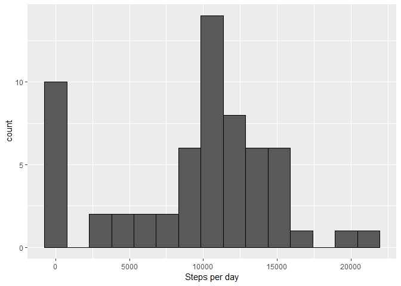
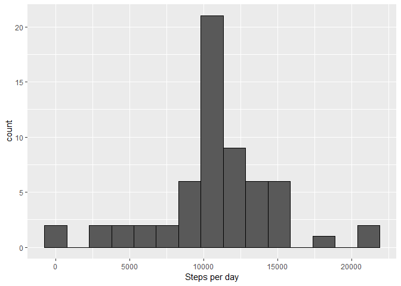
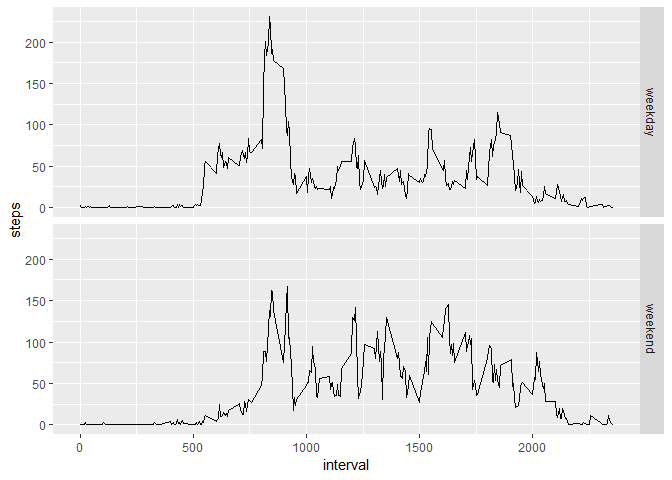

## Loading and preprocessing the data

* Load package tidyverse (it used for loading data and further analysis)

```
## Loading required package: tidyverse
```

```
## -- Attaching packages ---------------------------------------------------------------------------------------- tidyverse 1.2.1 --
```

```
## v ggplot2 3.1.0     v purrr   0.2.5
## v tibble  1.4.2     v dplyr   0.7.7
## v tidyr   0.8.2     v stringr 1.3.1
## v readr   1.1.1     v forcats 0.3.0
```

```
## -- Conflicts ------------------------------------------------------------------------------------------- tidyverse_conflicts() --
## x dplyr::filter() masks stats::filter()
## x dplyr::lag()    masks stats::lag()
```

* Unzip data file 
* Read data file


```r
unzip("activity.zip")
Act<-read_csv("activity.csv")
```

```
## Parsed with column specification:
## cols(
##   steps = col_integer(),
##   date = col_date(format = ""),
##   interval = col_integer()
## )
```

## What is mean total number of steps taken per day?

* Make histogram of steps


```r
Act %>% group_by(date) %>% summarise(StPerDay=sum(steps,na.rm = TRUE)) ->StPerDay # table Date~Sum of steps
ggplot(StPerDay,aes(StPerDay))+geom_histogram(bins = 15, colour="black")+xlab("Steps per day")
```

<!-- -->
 
* Median and mean steps per day
 

```r
mean(StPerDay$StPerDay)
```

```
## [1] 9354.23
```

```r
median(StPerDay$StPerDay)
```

```
## [1] 10395
```

## What is the average daily activity pattern?
* Time series plot of the 5-minute interval and the average number of steps taken


```r
Act %>% group_by(interval) %>% summarise(steps=mean(steps,na.rm = TRUE))->StPerInt
ggplot(StPerInt, aes(interval, steps))+geom_line()
```

<!-- -->

* 5-minute interval contains the maximum number of steps


```r
StPerInt$interval[which.max(StPerInt$steps)]
```

```
## [1] 835
```

## Imputing missing values

*The total number of missing values


```r
sum(is.na(Act$steps))
```

```
## [1] 2304
```
* Filling missing values by replacing mean value for 5-minute interval
* Create new dataset Act2


```r
left_join(Act,StPerInt[,1:2], by = "interval")%>%
    mutate(steps=if_else(is.na(steps.x),steps.y,as.numeric(steps.x)))%>%select(steps,date,interval)->Act2
```
* Make histogram of steps for new dataset (without NAs)

```r
Act2 %>% group_by(date) %>% summarise(StPerDay=sum(steps,na.rm = TRUE)) ->StPerDay2 # table Date~Sum of steps
ggplot(StPerDay2,aes(StPerDay))+geom_histogram(bins = 15, colour="black")+xlab("Steps per day")
```

<!-- -->

* Median and mean steps per day for new dataset (without NAs)

```r
mean(StPerDay2$StPerDay)
```

```
## [1] 10766.19
```

```r
median(StPerDay2$StPerDay)
```

```
## [1] 10766.19
```
**By imputing missing data we normalised histogram and increased mean and median values**

## Are there differences in activity patterns between weekdays and weekends?

* Creating a new factor variable in the dataset with two levels -- "weekday" and "weekend".  
_Becouse of the language properties I used $wday from POSIXlt date type instead of weekdays() function._  


```r
mutate(Act2,DWeek=factor(if_else(as.POSIXlt(date)$wday %in% c(0,6),"weekend","weekday"))) %>% 
    group_by(interval, DWeek) %>% summarise(steps=mean(steps,na.rm = TRUE))->StPerInt2
```
* Making a panel ts plot of the average number of steps taken, averaged across all weekday days or weekend days


```r
ggplot(StPerInt2, aes(interval, steps))+geom_line()+facet_grid(DWeek~.)
```

<!-- -->
